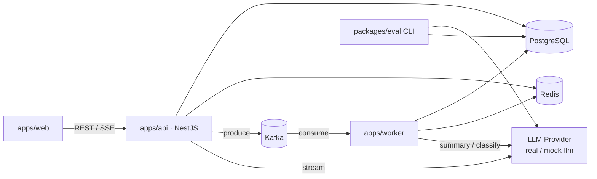
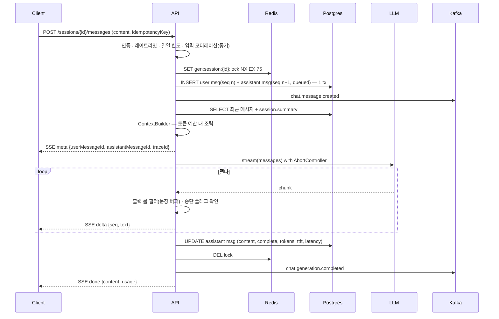

# ARCHITECTURE — Duet

## 1. 구성요소

- **api**: 요청 처리, 컨텍스트 조립, 생성 파이프라인, SSE 전송, 이벤트 발행. 무상태(멀티 인스턴스 가능).
- **worker**: 이벤트 소비. 사용량 집계, 출력 모더레이션 판정, 요약 메모리 갱신. api와 배포 단위 분리.
- **Redis**: 락·레이트리밋·스트리밍 버퍼·카운터. 영속 데이터 없음(모두 TTL).
- **PostgreSQL**: 단일 진실. 메시지 원문과 상태.
- **Kafka**: api → worker 비동기 경계. 파티션 키 session_id.

## 2. 핵심 흐름
### 2.1 메시지 전송 → 스트리밍 (M1 기본형)

- seq 채번은 같은 트랜잭션에서 `UPDATE sessions SET last_seq = last_seq + 2 … RETURNING` (DATA_MODEL.md §messages). Redis 락이 1차, 행 잠금이 2차, UNIQUE(session_id, seq)가 최후 방어.
- M2에서 델타를 Redis Stream `gen:{assistantMessageId}`에도 XADD 하고, SSE 전송부는 Redis Stream을 tail 하도록 바꾼다(§8).

### 2.2 이어보기 / attach (M2)
`GET /messages/{assistantMessageId}/stream` + `Last-Event-ID: k`
1. Redis Stream에서 seq > k 재전송 → 이후 라이브 tail (`XREAD BLOCK`)
2. Stream이 없으면(TTL 만료) DB 상태 조회 → complete/partial/aborted면 `done`(content 전체) 1건, queued/streaming이면 `GENERATION_NOT_STREAMABLE`
3. 클라이언트는 `done.content`를 항상 최종본으로 덮어쓴다 (누적 텍스트 불일치 방지)

### 2.3 요약 메모리 (M3)
- 트리거: 컨텍스트 조립 시 `unsummarized_count > 20 || unsummarized_tokens > 3000` → `chat.summary.requested` 발행. 세션당 in-flight 1개(Redis `summary:{sessionId}:inflight` SET NX).
- worker: `(summary_upto_seq, target_seq]` 메시지 + 기존 summary → 새 summary → `UPDATE sessions SET summary=?, summary_upto_seq=?, version=version+1 WHERE id=? AND version=?`
- 조립기는 summary 이후의 원문만 포함. 요약은 "관계 상태 · 확정된 사실 · 감정 흐름 · 약속" 4항목 고정 포맷.

### 2.4 모더레이션 (M3)
| 단계 | 시점 | 방식 | 실패 정책 |
|---|---|---|---|
| 입력 | 요청 경로(동기) | 룰 엔진(카테고리별 패턴) + 선택적 소형 모델 분류(800ms 타임아웃) | fail-open + 메트릭 |
| 출력-스트리밍 | 델타마다 | 문장 단위 버퍼에 하드블록 패턴 → 즉시 중단, status=failed(reason=safety) | fail-closed |
| 출력-사후 | generation.completed 소비 | 분류 모델 판정 → moderation_events. severe면 is_redacted=true + 리뷰 큐 | 재시도 후 DLQ |

### 2.5 사용량 (M2)
- 실시간 한도: 요청 경로에서 Redis `usage:{userId}:{yyyymmdd}` INCR.
- 정산: worker가 `generation.completed`를 `usage_daily`에 UPSERT. Redis와 DB가 다르면 DB가 진실, Redis는 만료로 자연 정리.

## 3. 생성(Generation) 상태 머신
```
queued ─▶ streaming ─▶ complete
                   ├─▶ partial   (프로바이더 오류/타임아웃, 첫 토큰 이후)
                   ├─▶ aborted   (유저 중단)
                   └─▶ failed    (첫 토큰 전 실패 · 안전 차단)
queued ─▶ failed                 (재시도·폴백 소진)
```
전이는 `generation/state.ts`의 `transition(current, event)`로만. 불법 전이는 예외.

## 4. 신뢰성 정책 (`config/generation.ts`)
| 항목 | 값 | 근거 |
|---|---|---|
| TTFT 타임아웃 | 10s | 첫 토큰 전이면 재시도/폴백 가능 |
| idle 타임아웃(델타 간) | 15s | 프로바이더 hang 감지 |
| total 타임아웃 | 60s | 락 TTL(75s)보다 짧아야 함 |
| 재시도 | 첫 토큰 전에만, 최대 2회, 지수 백오프 | 첫 토큰 이후 재시도는 중복 텍스트 위험 |
| 폴백 모델 | 재시도 소진 시 1회 | 가용성 > 품질 |
| 세션 동시 생성 | 1개 (Redis SET NX) | 순서·비용 보호. 위반 시 409 |
| 멱등성 | (session_id, idempotency_key) UNIQUE | 중복 POST는 기존 생성에 attach |
| 레이트리밋 | 유저당 20 req/min 토큰 버킷(Lua) | 429 + Retry-After |
| 일일 한도 | free 50 / plus 500 | 429 DAILY_LIMIT |
| SSE keepalive | 15s 코멘트 프레임 | 프록시 idle 종료 방지 |
| 클라이언트 이탈 | 생성은 계속, 버퍼에만 기록 (M2) | 다른 탭/재접속 지원. total 타임아웃이 상한 |

## 5. 컨텍스트 빌더 (`chat/context-builder.ts`)
- 예산 = `model_context_window − max_output_tokens − 안전 마진(256)`
- 배분: system(페르소나 + 안전 규칙 + locale 지시) 고정 → summary(있으면) → 최근 메시지 최신순으로 예산 소진까지. 최신 user 메시지는 항상 포함.
- 토큰 계산: js-tiktoken. 한국어는 글자수/4 근사가 크게 틀리므로 근사 금지.
- 출력: `{ messages, promptVersionId, tokenEstimate, droppedCount }`. droppedCount는 로그·메트릭으로.

## 6. AI Harness
### 6.1 프롬프트 버전
- `prompt_versions`는 불변 행. 세션은 생성 시점의 active 버전에 고정. 새 버전 활성화는 신규 세션에만 영향.

### 6.2 평가 파이프라인 (`packages/eval`)
- 골든셋 `eval/golden/{character}.jsonl` (1줄 1케이스):
  ```json
  {"id":"mina-012",
   "history":[{"role":"user","content":"..."},{"role":"assistant","content":"..."}],
   "user":"...",
   "expect":{"mustNot":["존댓말 전환"],"persona":["장난스러움","반말"],"safety":"none"}}
  ```
- 러너: ContextBuilder + LlmProvider를 직접 호출(HTTP 경유 안 함) → 응답 → judge 모델에 루브릭 →
  점수(in-character 1~5, coherence 1~5, safety pass/fail, language 일치) → `eval/reports/{date}-{versions}.md|json`
- 게이트: PR이 `prompts/` 또는 prompt 시드를 건드리면 CI에서 실행. in-character 평균 ≥ 4.0 · safety fail = 0 아니면 실패.

### 6.3 가드레일: §2.4

### 6.4 HITL 리뷰 큐 (M3 선택)
- `review_items`: pending → approved | removed. 결정은 Prepare(조회·검토) → Commit(결정) 2단계. `decision_id` 멱등.

## 7. 관측
- trace_id: 요청 진입 시 생성(또는 `x-trace-id` 수용) → AsyncLocalStorage → 로그 · SSE meta · Kafka 헤더로 전파. worker는 헤더에서 복원.
- 로그 필드: `traceId userId sessionId messageId model promptVersion status errorCode ttftMs latencyMs tokensIn tokensOut droppedCount`
- 메트릭(prom-client, `/metrics`):
  - `duet_generation_ttft_seconds{model,status}` histogram
  - `duet_generation_duration_seconds{model}` histogram
  - `duet_generation_total{status}` counter
  - `duet_tokens_total{direction}` counter
  - `duet_sse_active_streams` gauge
  - `duet_provider_errors_total{code}` counter
  - `duet_moderation_total{stage,verdict}` counter
  - `duet_ratelimit_rejections_total{reason}` counter
  - `duet_consumer_lag{topic}` gauge, `duet_consumer_failures_total{topic}` counter

## 8. 진화 계획
| 단계 | 구조 | 한계 → 다음 단계 이유 |
|---|---|---|
| M1 | 요청 프로세스가 프로바이더 스트림을 직접 SSE로 중계 | 재접속 불가, 인스턴스 간 공유 불가 |
| M2 | 생성기가 Redis Stream에 XADD, SSE 핸들러는 XREAD BLOCK으로 tail | 프로세스·인스턴스와 무관하게 attach/resume. 버퍼 TTL 10분 |
| M4 | api 2인스턴스 + 로드밸런서 아래에서 부하 테스트 | 락·버퍼가 인스턴스 경계에서 동작함을 실측 |

## 9. ADR 요약 (상세는 `docs/adr/`)
| # | 결정 | 대안 | 이유 |
|---|---|---|---|
| 0001 | SSE | WebSocket | 단방향 스트림엔 SSE가 단순 · 프록시 친화 · 재접속 표준(Last-Event-ID). 양방향(타이핑 표시 등) 필요 시 WS 재검토 |
| 0002 | POST가 곧 SSE 응답 + GET resume | 2단계(POST → GET stream) | RTT 1회 절약. resume/attach는 별도 GET |
| 0003 | Drizzle | Prisma / TypeORM | 생성되는 SQL이 그대로 보여 쿼리 최적화를 설명하기 쉬움 |
| 0004 | Kafka 파티션 키 = session_id | message_id | 세션 내 순서 보장. 핫 세션 편중은 이 규모에서 무시 가능 |
| 0005 | 재시도는 첫 토큰 전에만 | 항상 재시도 | 중복 출력 방지. partial 저장이 더 정직한 실패 |
| 0006 | 입력 fail-open / 출력 하드블록 fail-closed | 전부 fail-closed | 가용성과 안전의 비대칭 위험 |
| 0007 | Redis Stream 버퍼 | 프로세스 메모리 버퍼 | 멀티 인스턴스 · 재접속 |
