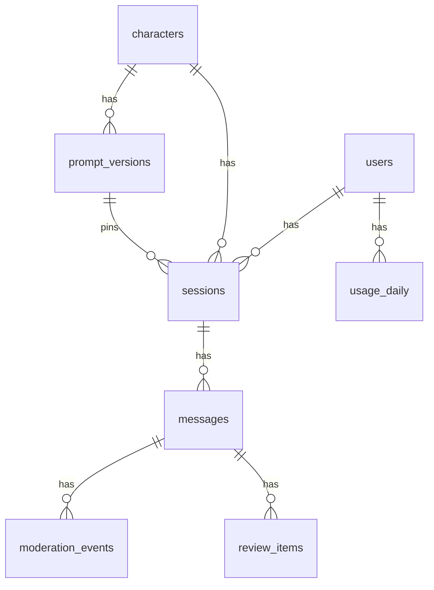

# DATA MODEL — Duet

## ERD

## 테이블
공통: `id uuid PK (v7)`, `created_at timestamptz NOT NULL DEFAULT now()`. 소프트 삭제 없음.
문자열 enum 컬럼은 전부 CHECK 제약으로 값 집합을 고정한다.

### users
| 컬럼 | 타입 | 비고 |
|---|---|---|
| handle | text UNIQUE | dev-login 식별자 |
| plan | text | `free` \| `plus` |
| locale | text | `ko` \| `en` \| `ja` |

### characters
| 컬럼 | 타입 | 비고 |
|---|---|---|
| slug | text UNIQUE | URL 식별자 |
| name, tagline, avatar_emoji | text | |
| locale | text | 기본 응답 언어 |
| opening_line | text | 세션 시작 시 첫 assistant 메시지 |
| safety_level | text | `standard` (확장용) |
| is_active | boolean | |

### prompt_versions (불변)
| 컬럼 | 타입 | 비고 |
|---|---|---|
| character_id | uuid FK | |
| version | int | UNIQUE(character_id, version) |
| system_prompt | text | 페르소나 + 말투 + 금기 |
| model | text | 기본 모델 |
| params | jsonb | temperature, max_output_tokens 등 |
| is_active | boolean | 캐릭터당 1개: `UNIQUE (character_id) WHERE is_active` 부분 유니크 인덱스 |

### sessions
| 컬럼 | 타입 | 비고 |
|---|---|---|
| user_id, character_id, prompt_version_id | uuid FK | |
| locale | text | 응답 언어 |
| title | text NULL | |
| status | text | `active` |
| summary | text NULL | 요약 메모리 |
| summary_upto_seq | int DEFAULT 0 | 이 seq까지 요약에 반영됨 |
| version | int DEFAULT 0 | 요약 갱신 낙관적 락 |
| last_seq | int DEFAULT 0 | seq 채번 원본 |
| last_message_at | timestamptz | |
- INDEX `(user_id, last_message_at DESC)` — 내 세션 목록

### messages
| 컬럼 | 타입 | 비고 |
|---|---|---|
| session_id | uuid FK | |
| seq | int | 세션 내 1부터. UNIQUE(session_id, seq) |
| role | text | `user` \| `assistant` \| `system` |
| content | text | partial/aborted도 저장 |
| status | text | `queued` \| `streaming` \| `complete` \| `partial` \| `aborted` \| `failed` |
| is_redacted | boolean DEFAULT false | 사후 모더레이션 결과 |
| idempotency_key | text NULL | user 메시지만. `UNIQUE(session_id, idempotency_key) WHERE idempotency_key IS NOT NULL` |
| reply_to_seq | int NULL | assistant → 대응 user seq |
| prompt_version_id | uuid NULL | assistant만 |
| model | text NULL | assistant만. 폴백 시 실제 사용 모델 |
| tokens_in, tokens_out, ttft_ms, latency_ms | int NULL | |
| finish_reason | text NULL | `stop` \| `length` \| `aborted` \| `provider_error` \| `safety` |
| trace_id | uuid | |
- INDEX `(session_id, seq DESC)` — 히스토리 커서 조회의 유일한 경로. `WHERE session_id = ? AND seq < ? ORDER BY seq DESC LIMIT 50`
- **seq 채번**: `UPDATE sessions SET last_seq = last_seq + 2 WHERE id = ? RETURNING last_seq` 로 user(n-1)·assistant(n) 두 개를 한 번에 확보. 행 잠금이 직렬화를 보장하고 Redis 세션 락은 그 바깥의 1차 방어. `MAX(seq)+1` 방식은 쓰지 않는다.
- 파티셔닝: 100만 행 시드에서 인덱스만으로 목표 달성 여부를 먼저 측정. 미달 시 session_id 해시 파티션 검토(PERF.md에 기록).

### moderation_events
| 컬럼 | 타입 | 비고 |
|---|---|---|
| message_id | uuid FK | |
| stage | text | `input` \| `output_stream` \| `output_async` |
| verdict | text | `allow` \| `flag` \| `block` |
| categories | jsonb | 위반 카테고리 배열 |
| score | numeric NULL | 분류 모델 점수 |
| model | text NULL | |
- INDEX `(message_id)`

### review_items (M3 선택)
| 컬럼 | 타입 | 비고 |
|---|---|---|
| message_id | uuid FK | |
| reason | text | |
| status | text | `pending` \| `approved` \| `removed` |
| decision_id | uuid UNIQUE NULL | 결정 멱등 키 |
| decided_by | text NULL | |
| decided_at | timestamptz NULL | |
- INDEX `(status, created_at)`

### usage_daily
| 컬럼 | 타입 | 비고 |
|---|---|---|
| user_id | uuid FK | |
| day | date | |
| messages | int | |
| tokens_in, tokens_out | bigint | |
- PK `(user_id, day)`. worker가 UPSERT.

### processed_events (컨슈머 멱등)
| 컬럼 | 타입 | 비고 |
|---|---|---|
| event_id | uuid | |
| consumer | text | 컨슈머 그룹 이름 |
| processed_at | timestamptz | |
- PK `(event_id, consumer)`. 처리와 INSERT를 같은 트랜잭션으로. 충돌이면 스킵.
- 보존 7일. 주기적 삭제 잡(worker).

## Redis 키
| 키 | 타입 | TTL | 용도 |
|---|---|---|---|
| `gen:session:{sessionId}:lock` | string | 75s | 세션당 생성 1개 (SET NX) |
| `gen:{assistantMessageId}` | stream | 10m | 델타 버퍼. 엔트리 필드 `seq`, `text`; 종료 마커 `end=1` |
| `gen:{assistantMessageId}:abort` | string | 75s | 중단 플래그 |
| `rl:{userId}` | hash | 2m | Lua 토큰 버킷 (tokens, ts) |
| `usage:{userId}:{yyyymmdd}` | string(int) | 48h | 일일 한도 카운터 |
| `summary:{sessionId}:inflight` | string | 5m | 요약 작업 중복 방지 |

## 시드
- `db:seed`: 캐릭터 3명(전원 성인 · 성격/말투/금기 상이, 예: 미나 — 장난스러운 카페 사장 / 도현 — 무뚝뚝한 탐정 / 리사 — 영어권 유학생 친구) + 각 prompt_version 1 + dev 유저 2명(free/plus)
- `db:seed:perf`: 유저 1,000 · 세션 10,000 · 메시지 1,000,000 을 `COPY`로 적재. 로컬 측정 전용.

## 마이그레이션 규칙
- `drizzle-kit generate` → 생성된 SQL 리뷰 후 커밋. 손으로 고친 SQL은 파일 상단에 이유.
- 파괴적 변경(컬럼 삭제·타입 변경)은 2단계(추가 → 전환 → 삭제).
- 인덱스 추가는 `CREATE INDEX CONCURRENTLY` (트랜잭션 밖).
